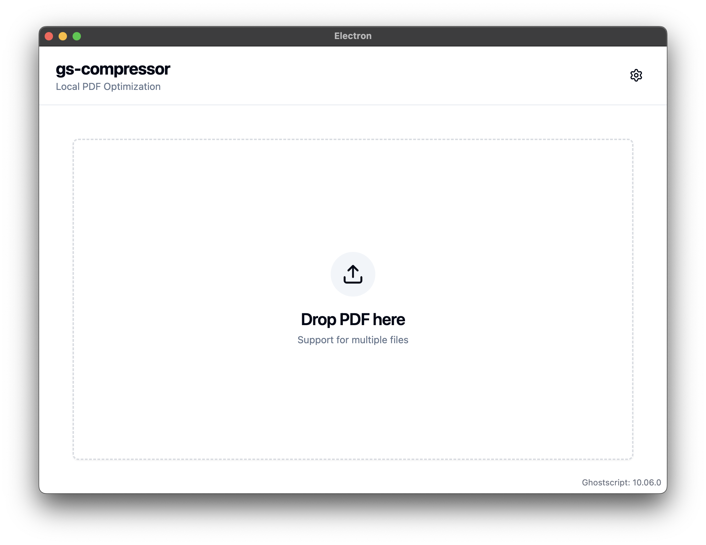

# GS Compressor

<div align="center">
  
  
  **Local PDF Optimization Tool**

一個基於 Ghostscript 的本地 PDF 壓縮工具，讓你在不上傳到雲端的情況下快速優化 PDF 檔案大小。

[](https://github.com/natsuki221/gs-compressor/actions)
[]()
[]()
[]()

</div>

---

## ✨ Features

- 🚀 **本地壓縮** - 無需上傳，保護隱私
- 🎯 **批量處理** - 支援同時壓縮多個 PDF 檔案
- 📊 **智慧優化** - 三種場景模式（AI/Print/Transfer）
- 💾 **自動檔名** - 壓縮檔自動命名為 `原檔名_compressed.pdf`
- 🎨 **Fusion Pro UI** - 專業三欄式佈局，支援預覽與即時設定
- 📈 **即時回饋** - 顯示壓縮進度、預估大小與壓縮比

---

## 📸 Screenshots

<div align="center">
  
  <p><i>Fusion Pro Layout: Queue | Preview | Settings</i></p>
</div>

---

## 🛠 Tech Stack

- **Frontend**: React 19 + TypeScript + Tailwind CSS
- **UI Components**: shadcn/ui + Radix UI
- **State Management**: Zustand
- **Desktop Framework**: Electron 39
- **Build Tool**: electron-vite
- **PDF Engine**: Ghostscript 10.x

---

## 📦 Installation

### Prerequisites

在使用本應用前，需要先安裝 **Ghostscript**：

```bash
# macOS (使用 Homebrew)
brew install ghostscript

# 驗證安裝
gs --version
```

### Download

從 [Releases](https://github.com/natsuki221/gs-compressor/releases) 頁面下載最新版本：

- **macOS (ARM64)**: `gs-compressor-<version>.dmg`
- **macOS (Intel)**: `gs-compressor-<version>-x64.dmg` (尚未支援)

---

## 🚀 Usage

1. **開啟應用**
2. **拖放 PDF 檔案** 到左側佇列，或點擊「新增檔案」
3. **在右側面板選擇場景**：
   - 🤖 **AI Mode**: 為 LLM 上傳優化 (極致壓縮)
   - 🖨️ **Print Mode**: 為實體列印優化
   - 📧 **Transfer Mode**: 平衡畫質與大小
4. **點擊 Compress Files** 開始壓縮
5. **在佇列中點擊「開啟位置」** 查看結果

### 壓縮模式說明

| 模式              | 適用情境            | 特性                 | 檔案大小 |
| ----------------- | ------------------- | -------------------- | -------- |
| **AI Mode**       | ChatGPT/Claude 上傳 | 移除圖片、向量化文字 | 極小     |
| **Print Mode**    | 實體文件列印        | 300 DPI、保留細節    | 較大     |
| **Transfer Mode** | Email/Line 傳輸     | 150 DPI、平衡壓縮    | 中等     |

---

## 💻 Development

### Setup

```bash
# Clone repository
git clone https://github.com/natsuki221/gs-compressor.git
cd gs-compressor

# Install dependencies
npm install

# Start development mode
npm run dev
```

### Build

```bash
# Build for macOS
npm run build:mac

# Build for Windows (experimental)
npm run build:win

# Build for Linux (experimental)
npm run build:linux
```

產出檔案位於 `dist/` 目錄。

---

## 📁 Project Structure

```
gs-compressor/
├── src/
│   ├── main/           # Electron 主進程
│   │   ├── ipc/        # IPC 處理器
│   │   └── services/   # Ghostscript 服務
│   ├── renderer/       # React 渲染進程
│   │   ├── components/ # UI 元件
│   │   └── features/   # 功能模組 (Queue, Settings)
│   ├── preload/        # Preload 腳本 (安全橋接)
│   └── shared/         # 共享類型定義
├── resources/          # 資源檔案
├── docs/              # 文件與 Stories
└── electron-builder.yml
```

---

## 🤝 Contributing

歡迎貢獻！請先開 Issue 討論你想要的功能或修復。

1. Fork this repository
2. Create your feature branch (`git checkout -b feature/amazing-feature`)
3. Commit your changes (`git commit -m 'Add some amazing feature'`)
4. Push to the branch (`git push origin feature/amazing-feature`)
5. Open a Pull Request

---

## 📝 License

本專案採用 MIT 授權 - 詳見 [LICENSE](LICENSE) 文件。

---

## 🙏 Acknowledgments

- [Ghostscript](https://www.ghostscript.com/) - 強大的 PDF 處理引擎
- [shadcn/ui](https://ui.shadcn.com/) - 優雅的 UI 組件庫
- [Electron](https://www.electronjs.org/) - 跨平台桌面應用框架

---

## ⚠️ Known Issues

- **Windows/Linux**: 尚未完全測試和優化
- **Ghostscript 版本**: 需要 10.x 以上版本

---

<div align="center">
  Made with ❤️ by natsuki
</div>
