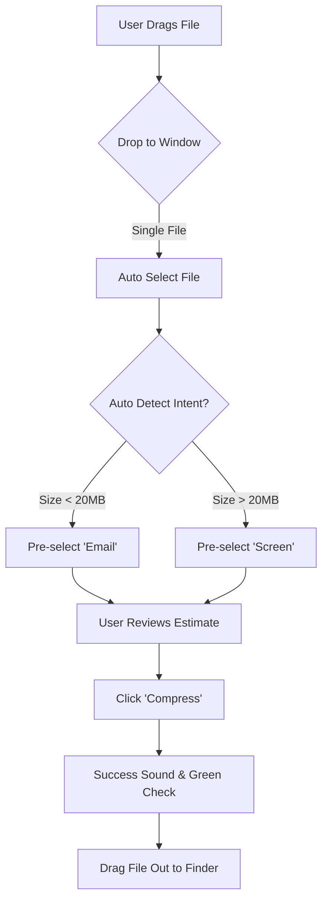

# UX Design Specification gs-compressor

**Author:** natsuki
**Date:** 2025-12-12

---

## Executive Summary

### Project Vision

gs-compressor 是一個專為注重隱私的用戶設計的本地端桌面應用程式。它的核心目標是消除「排版焦慮 (Layout Anxiety)」，提供「零排版位移」的 PDF 壓縮保證。不同於線上工具，它堅持 **離線優先 (Offline-First)** 與 **場景導向 (Scenario-Based)** 的設計哲學，讓用戶無需具備技術知識（如 DPI 設定），僅需選擇意圖（如「AI 準備」、「列印」、「傳輸」）即可獲得最佳且安全的壓縮結果。

### Target Users

- **焦慮的提交者 (如 Alex)**：學生或求職者，需要上傳作品集或論文。他們對檔案大小限制感到壓力，但更恐懼壓縮工具破壞他們精心設計的排版。他們需要「絕對的視覺安全感」。
- **隱私意識開發者 (如 Sam)**：需要處理稅務或敏感合約，拒絕將檔案上傳至任何雲端伺服器。他們重視「離線運作」的透明度與純淨的軟體體驗。
- **辦公室管理員 (如 Linda)**：需批量處理大量文件以配合老舊硬體。他們需要穩定且高效的「批量拖放」體驗。

### Key Design Challenges

1.  **信任的可視化 (Visualizing Trust)**：如何在不強迫用戶每次都檢查預覽的情況下，建立對「零排版位移」與「離線安全」的信心？
2.  **複雜性的抽象化 (Abstracting Complexity)**：底層 Ghostscript 參數極為複雜，挑戰在於如何透過簡單的「場景預設」隱藏這些技術細節，同時不讓進階用戶感到受限。
3.  **批量處理的回饋 (Feedback for Batch)**：在處理大量檔案（如 50+ 個）時，如何提供清晰的單檔進度與整體狀態，避免介面看起來凍結。

### Design Opportunities

1.  **意圖優先介面 (Intent-First Interface)**：打破傳統「選擇品質 (Low/Medium/High)」的模式，轉而設計「選擇目的 (AI/Print/Email)」的導航，這在 PDF 工具中是一個差異化的 UX 模式。
2.  **靜默的安心感 (Quiet Confidence)**：透過微互動（如離線狀態指示器、無網路請求的明確訊號）來強化隱私安全的產品定位。
3.  **無摩擦的拖放 (Frictionless Drag & Drop)**：將 App 設計為「隨顯隨用」的工具，極大化拖放區域的易用性，使其感覺像是一個原生 OS 功能的延伸。

<!-- UX design content will be appended sequentially through collaborative workflow steps -->

## Desired Emotional Response

### Primary Emotional Goals

- **Relief (如釋重負/寬慰)**：這是最重要的情緒。用戶帶著「檔案太大」或「怕排版跑掉」的焦慮而來，他們離開時應該感到寬慰——問題解決了，而且沒有產生新的問題（排版崩壞）。
- **Safety (安全感)**：特別是對於隱私敏感的用戶，他們應該感到像是在一個封閉、安全的保險箱內操作，沒有任何資料洩漏的恐懼。

### Emotional Journey Mapping

1.  **Discovery (發現)**：_希望/懷疑_ - "這個工具真的能不破壞我的排版嗎？"
2.  **Action (操作)**：_掌控感_ - 拖放檔案，選擇意圖。感覺自己是在控制軟體，而不是被技術參數困擾。
3.  **Completion (完成)**：_驚喜/驗證_ - 看到壓縮率，打開預覽，確認排版完美。懷疑轉化為信任。
4.  **Long-term (長期)**：_依賴/平靜_ - 下次遇到大檔案時，不再焦慮，因為知道有一個可靠的工具在 Dock 上。

### Micro-Emotions

- **Vs. Skepticism (對抗懷疑)**：透過在完成壓縮後立即顯示「原始 vs 壓縮後」的對比數據，消除用戶對「真的有壓縮嗎？」的懷疑。
- **Vs. Tech-Shame (對抗技術羞愧)**：避免使用 "Incorrect DPI" 這種會讓非技術用戶覺得自己笨的錯誤訊息。改用 "Try Print Mode better results" 這種建設性引導。

### Design Implications

- **冷靜的色彩 (Calm Colors)**：使用能傳遞專業與冷靜的色彩（如深藍、石墨灰、森林綠），避免使用會引發緊張的高飽和度紅色或霓虹色。
- **穩定的動效 (Stable Motion)**：動畫應該是穩重、流暢的，避免過快或跳耀的轉場，以傳遞軟體的穩定性。
- **隱私的沉默 (Privacy Silence)**：除了更新通知外，App 應該保持安靜。沒有彈窗、沒有評分請求、沒有「訂閱電子報」。這種「安靜」本身就是一種強大的隱私宣言。

### Emotional Design Principles

1.  **Don't Startle (不要驚嚇)**：除非發生毀滅性錯誤，否則不要對用戶大吼大叫（巨大的錯誤圖示、刺耳的音效）。
2.  **Guide, Don't Blame (引導，不指責)**：當用戶拖入不支援的檔案時，溫柔地告訴他們可以拖入什麼，而不是說他們做錯了。
3.  **Celebrate Quietly (安靜地慶祝)**：壓縮完成是一個微小的勝利，給予一個精緻的勾選動畫即可，不需要放煙火。

## UX Pattern Analysis & Inspiration

### Inspiring Products Analysis

1.  **ImageOptim (macOS)**: 它的「無介面 UI (Zero-Interface UI)」是極大的啟發。打開 App 視窗就是拖放區，檔案拖進去直接開始處理，處理完直接顯示節省空間。**它證明了「工具」可以只是「功能」的純粹容器。**
2.  **HandBrake (Video)**: 雖然功能強大且參數複雜，但它透過 **"Presets" (預設集)** 很好地管理了複雜度。它讓專家可以調整 bitrate，但讓新手可以直接選 "Fast 1080p30"。
3.  **Transmit (FTP Client)**: 它將無聊的檔案傳輸變得「有趣」且「令人放心」。它的進度條設計、完成時的音效、以及處理錯誤的優雅方式，都是我們學習的對象。

### Transferable UX Patterns

- **The "Drop Zone" as Main UI**: 不要做一個「有按鈕的歡迎畫面」，直接把整個視窗做成一個巨大的感應區。這是 ImageOptim 的核心模式。
- **Results-First List**: 檔案列表不應該只顯示檔名，而應該把「原始大小 -> 壓縮後大小」做為最顯眼的資訊。
- **Preset Toggle**: 从 HandBrake 學習，將複雜參數封裝在 "Scenario Presets" 中，但使用更現代的 Toggle 或 Card 選擇器，而不是傳統的下拉選單。

### Anti-Patterns to Avoid

- **"Are you sure?" Dialogs**: 除非是刪除檔案，否則不要阻擋用戶的操作。壓縮是無損的（產生新檔），所以不需要確認，直接執行。
- **Fake Progress Bars**: 絕對不要為了讓 App 看起來在工作而顯示假的進度。如果處理只需 0.1秒，就直接顯示完成。
- **Hidden "Pro" Features**: 不要把進階功能藏得太深，讓專家找不到。應該使用漸進式揭露 (Progressive Disclosure)，讓 "Advanced" 區域易於展開。

### Design Inspiration Strategy

我們將採納 **ImageOptim 的「即時性」** 與 **HandBrake 的「預設集管理」**，但加上我們獨有的 **「隱私靜默感」**。
我們的目標是創造一個比 ImageOptim 更現代（視覺上更精緻），但比 HandBrake 更親民（去除技術術語）的獨特體驗。

## Design System Foundation

### 1.1 Design System Choice

**shadcn/ui** (基於 Radix UI + Tailwind CSS)。

### Rationale for Selection

- **Best of Both Worlds**: 它不是一個傳統的 Component Library（如 MUI），而是一個 Copy/Paste 的架構。這意味著我們擁有 **100% 的原始碼控制權**，可以任意修改組件以符合我們獨特的視覺需求，而不會被 Library 的限制卡住。
- **Tailwind Native**: 我們的專案已經配置了 Tailwind CSS。shadcn/ui 是為 Tailwind 原生設計的，整合無縫且效能極佳。
- **Accessibility (無障礙)**: 底層使用 Radix UI，保證了鍵盤導航和螢幕閱讀器的完美支援，這對於高品質桌面應用是必須的。
- **Premium "Feel"**: 它的預設設計風格極簡且質感極佳，非常符合我們想要的「安靜、專業」的工具調性。

### Implementation Approach

- 使用 `npx shadcn@latest init` 初始化。
- 按需安裝核心組件：`Button` (按鈕), `Card` (卡片容器), `Progress` (進度條), `Toast` (通知), `Dialog` (模態框)。
- 不引入不必要的重型組件（如 Data Table），保持 bundle size 輕量。

### Customization Strategy

- **Radius**: 設定為 `0.5rem` (8px) 或 `0.75rem` (12px)，創造現代且友善的圓角（配合 macOS Big Sur+ 風格）。
- **Colors**: 定義一組 "Privacy Blue/Green" 的自定義色票，覆蓋 shadcn 的預設 Zinc/Slate 色系，建立品牌識別。
- **Dark Mode**: 強制支援並最佳化 Dark Mode，這對於開發者工具類應用是標準配備。

### Core User Experience

### 2.1 Defining Experience

**"The Safe Drop" (安全投遞)**。
用戶不應該感覺他們在「操作一個複雜的機器」，而應該感覺他們只是把檔案「放進一個安全的信封」裡。
核心互動：**Drag (檔案) -> Drop (至視窗) -> Select (場景) -> Done**。
這個流程必須比打開 Adobe Acrobat -> Save as Optimized PDF 快 10 倍以上。

### 2.2 User Mental Model

- **Current (現狀)**: 用戶害怕壓縮軟體，就像害怕洗衣服會縮水一樣。他們的心智模型是：「壓縮 = 品質損失風險」。
- **Desired (期望)**: 我們要將心智模型轉變為：「壓縮 = 移除脂肪，保留肌肉」。
- **Strategy (策略)**: 透過「場景選擇」(例如 "On-Screen Reading" 或 "High-Quality Print") 來取代技術參數，讓用戶覺得軟體「懂」他們的需求。

### 2.3 Success Criteria

1.  **Speed**: 從拖放到開始處理，中間不超過 1 次點擊。
2.  **Safety**: 100% 離線。如果有任何網路請求（例如檢查更新），必須明確告知。
3.  **Clarity**: 壓縮結果必須並排顯示「原始大小」與「新大小」，以及「節省了多少 %」。

### 2.4 Novel UX Patterns

- **Intent-Based Cards**: 我們不使用下拉選單選擇品質，而是使用一組大張的、視覺化的「意圖卡片」。
  - 卡片 1: **Screen** (適合螢幕閱讀，高壓縮)
  - 卡片 2: **E-Book** (平衡品質與大小，中壓縮)
  - 卡片 3: **Print** (最高品質，低壓縮)
  - 卡片 4: **Prepress** (AI 準備，色彩無損)
    這種「視覺化意圖」在 PDF 壓縮工具中是創新的。

### 2.5 Experience Mechanics

1.  **Initiation**: 用戶拖曳檔案進入視窗。Drop Zone 在 hover 時會有微互動（如發光或磁吸效果），暗示「這裡可以放」。
2.  **Interaction**:
    - 如果是單檔：直接顯示「意圖卡片」供選擇。
    - 如果是多檔：顯示列表，並詢問「全部套用」或「個別設定」。
3.  **Feedback**: 處理中時，卡片會有 subtle 的呼吸燈效果 (Pulse)，而不是傳統的 Loading Bar。
4.  **Completion**: 完成後，以綠色勾選標記顯示，並發出悅耳的 "Success" 音效（參考 Transmit）。直接顯示 "Open Folder" 按鈕。

## Visual Design Foundation

### Color System

- **Base Neutral (基底中性色)**: 使用 **Zinc (鋅色)** 色系 (`slate-50` to `slate-950`)。這比純灰更溫暖，比藍灰更現代，能傳遞出堅固的工具質感。
- **Primary Brand (主品牌色)**: **Intelligent Navy (#0F172A)**。深邃、冷靜、專業。用於主要按鈕與強調區域。
- **Functional Colors (功能色)**:
  - _Success_: **Emerald (#10B981)** - 傳遞「安全完成」的訊號，與隱私主題呼應。
  - _Error_: **Rose (#F43F5E)** - 比標準紅更柔和，減少驚嚇感。
- **Dark Mode**: 使用 **Deep Blue Black (#020617)** 作為背景，而非純黑，以減輕長時間使用的視覺疲勞。

### Typography System

- **Font Family**: `Inter` (Sans-serif)。這是最安全的選擇，擁有極佳的螢幕易讀性與多種字重。
- **Hierachy (層級)**:
  - _H1 (Headings)_: Bold, Tracking-tight. 用於 "Compression Complete" 等狀態宣告。
  - _Body_: Regular, Leading-relaxed. 用於一般說明。
  - _Mono_: `JetBrains Mono` 或 `SF Mono`。用於顯示檔案大小 (e.g., `24.5 MB -> 1.2 MB`)，確保數字對齊且具備技術感。

### Spacing & Layout Foundation

- **Base Unit**: `4px` (Tailwind default)。
- **Layout Logic**: **"Airy but Dense"**。
  - _Outer Padding_: 大量的外部留白 (p-6, p-8)，創造呼吸感。
  - _Inner Density_: 組件內部緊湊 (gap-2)，強化關聯性。
- **Container**: 固定寬度或限制最大寬度 (max-w-md)，因為這是一個專注的小工具，不應該佔滿整個 27 吋螢幕。

### Accessibility Considerations

- **Contrast**: 所有的文字與背景對比度至少達到 **4.5:1 (AA級)**。
- **Focus States**: 重新設計 shadcn 的 `ring` 樣式，確保鍵盤導航時的焦點清晰可見 (使用 Brand Color 的 Ring)。

### Accessibility Considerations

- **Contrast**: 所有的文字與背景對比度至少達到 **4.5:1 (AA級)**。
- **Focus States**: 重新設計 shadcn 的 `ring` 樣式，確保鍵盤導航時的焦點清晰可見 (使用 Brand Color 的 Ring)。
- **Reduced Motion**: 尊重 OS 的 "Reduce Motion" 設定，在偵測到該設定時關閉所有裝飾性動畫。

## Design Direction Decision

### Design Directions Explored

我們探索了 5 個主要的設計方向：

1.  **Minimalist Focus**: 極簡主義，除了 Drop Zone 幾乎無介面。
2.  **Card-Based Intent**: 視覺化意圖卡片，強調「目的」而非「參數」。
3.  **Data-First Density**: 傳統列表，強調資訊密度。
4.  **Dark Mode Pro**: 開發者駭客風格。
5.  **Fusion Pro (Chosen)**: 結合用戶原始設計的佈局與我們的意圖導向設計。

### Chosen Direction

**Direction 5: Fusion Pro**。
這是一個混合型方案，結合了：

- **Layout**: 用戶原始的三欄式佈局 (左側 Batch Queue，中間 Preview，右側 Settings)。
- **Controls**: 採用 **"Hybrid Intent"** 模式。在 Settings 面板頂部優先顯示「意圖預設集」(Screen/Print/Email)，但在下方保留細部控制 (Slider) 供進階調整。
- **Style**: 使用我們定義的 **Intelligent Navy** 視覺風格 (shadcn/ui + Tailwind)，讓它看起來既現代又專業。

### Design Rationale

- **Best for Workflow**: 三欄式佈局最適合批量處理流程 (Batch Processing)，用戶可以一邊看左側的清單進度，一邊在右側調整設定，並在中間即時預覽。
- **Mental Model Bridge**: "Hybrid Intent" 成功橋接了新手 (只按 Screen/Print) 與專家 (需要調 DPI) 的需求。
- **Familiar yet Fresh**: 保留了用戶熟悉的工具佈局，但透過視覺優化消除了「舊軟體」的陳舊感。

### Implementation Approach

- **Shell**: Electron 視窗，固定最小尺寸。
- **Components**: 使用 shadcn/ui 的 `ResizablePanel` 來實作三欄式拖拉調整。
- **Icons**: 使用 `Lucide React` 或 `Material Symbols` (為了配合用戶原設計偏好)。

## User Journey Flows

### The "Quick Drop" Journey (單檔快速處理)

這是最常見的用例：用戶只想快速縮小一個檔案以發送郵件。
**Flow Highlights**:

- 拖入檔案後，**自動選中**該檔案，右側設定面板**自動打開**。
- 如果檔案大小 < 20MB，系統預判為 Email 用途，**自動預選 "Email" 意圖**。
- 用戶只需點擊 "Compress" 或直接拖出檔案即可完成。



### The "Power Batch" Journey (批量專業處理)

這是 Fusion Pro 介面真正發揮威力的地方：用戶需要處理整個專案文件夾。
**Flow Highlights**:

- **Initial Drop**: 拖入多個檔案，左側列表顯示所有檔案。
- **Selection Control**: 列表標頭提供 **"Select All" Checkbox**。每個檔案左側有獨立 Checkbox，讓用戶擁有明確的控制感。
- **Batch Settings**: 右側面板僅針對 **「已勾選 (Checked)」** 的檔案進行設定調整。
- **Live Feedback**: 設定 "Screen" 意圖後，列表中的 "Est. Size" 欄位會即時更新所有勾選檔案的預估值。

```mermaid
graph TD
    Start[User Drags Folder] --> ListPopulate[Populate Batch Queue]
    ListPopulate --> AutoCheck[All Files Auto-Checked]
    AutoCheck --> Review{User Review}
    Review --> |Uncheck Specific| Uncheck[Deselect unwanted files]
    Review --> |Click Select All| ToggleAll[Toggle Selection]
    Review --> RightPanel[Right Settings Panel Updates based on Selection]
    RightPanel --> Intent[User Clicks 'Screen' Intent]
    Intent --> LiveCalc[Update Est. Size for CHECKED files only]
    LiveCalc --> Action[Click 'Compress Selected (N)']
    Action --> Processing[Parallel Processing]
    Processing --> Finish[Show Report Summary]
```

### Journey Patterns

1.  **Selection-Driven Settings (選取驅動設定)**: 右側面板永遠顯示「當前選取物件」的設定。如果沒選，則顯示全域預設值。
2.  **Explicit Control (明確控制)**: 使用 Checkbox 明確指示哪些檔案會被處理，消除「我到底在改哪個檔案」的焦慮。
3.  **Action Persistence (動作持久性)**: 壓縮完成後，原始檔案與新檔案並存，直到用戶明確「清除」或「關閉」。

## Component Strategy

### Design System Components

我們將直接使用以下來自 shadcn/ui 的組件（只需修改 Theme 顏色）：

- `Button`: 用於所有傳統按鈕。
- `Slider`: 用於品質調整。
- `Checkbox`: 用於檔案選選取 (關鍵功能)。
- `Switch`: 用於 Grayscale/Metadata 開關。
- `ResizablePanel`: 用於三欄式佈局的拖拉調整。
- `Badge`: 用於顯示檔案狀態 (Done, Processing)。

### Custom Components

我們需要從零打造以下特定組件，以實現獨特的用戶體驗：

#### 1. IntentCard (意圖卡片)

- **Purpose**: 用戶選擇壓縮目標的核心組件 (Screen/Print/Email)。
- **States**:
  - _Default_: 顯示 Icon 與標題。
  - _Active_: 亮起 Brand Color 外框，右上角顯示勾選。
  - _Compact_: 在右側設定面板中縮小顯示 (Fusion Pro 特性)。

#### 2. DropZone (檔案投遞區)

- **Purpose**: 處理檔案拖放與預覽的回饋。
- **States**:
  - _Idle_: 顯示 "Drop PDF here"。
  - _Hover_: 顯示 "Drop to Add 3 Files" (動態計數)。
  - _Processing_: 顯示整體進度圓環。

#### 3. FileListItem (檔案列表項目)

- **Purpose**: 顯示單個檔案的狀態與 Selection。
- **Anatomy**: `[Checkbox] [Icon] [Filename/Size] ... [Status Badge] [Delete Btn]`。
- **Interaction**: 點擊以「單選」並在中間預覽；勾選以「多選」並在右側批次設定。

### Implementation Roadmap

1.  **Phase 1 (Core)**: 設置 shadcn/ui 環境，實作 `DropZone` 與基本 `FileListItem` (無預覽功能)。
2.  **Phase 2 (Logic)**: 實作 `IntentCard` 邏輯與 `BatchSettings` 面板的連動。
3.  **Phase 3 (Polish)**: 加入 `ResizablePanel` 與動畫效果。

## UX Consistency Patterns

### Button Hierarchy

- **Primary Action**: 整個視窗只有一個 Primary Button，就是右下角的 **"Compress"**。使用 `Intelligent Navy` 背景。
- **Contextual Actions**: 列表中的操作（如移除檔案、清除）使用 `Ghost` 或 `Outline` 樣式，避免搶奪注意力。
- **Intent Tokens**: 意圖卡片 (Intent Card) 本身就是巨大的 Toggle Button，選中狀態必須有明確的 `Ring` 與 `Checkmark`。

### Feedback Patterns

- **Non-Blocking**: 所有成功/錯誤訊息都使用 `Toast` (右下角彈出)，不使用 Modal 打斷用戶。
- **Progressive**: 長時間任務 (Batch Compress) 使用左側列表的 Item Progress Bar，而不是蓋住畫面的 Loading Mask。用戶可以隨時取消單個任務。
- **Completion**: 任務完成時播放 "Pluck" 音效（致敬 Transmit），並顯示 "Open Folder" 的 Call to Action。

### List Interaction Patterns

- **Click vs Check**:
  - **Click (整個 Row)**: 預覽該檔案 (Preview Mode)。
  - **Check (Checkbox)**: 將該檔案納入批次處理範圍 (Batch Scope)。
- **Hover Reveal**: 檔案列表中的 "Delete (X)" 按鈕只在 Hover 時顯示，保持介面乾淨 (除非在 Touch 裝置)。

### Integration with Design System

- **Theme Extension**: 我們將擴充 shadcn/ui 的 color tokens，增加 `intent-screen`, `intent-print` 等語意化顏色，讓意圖選擇更直覺。

## Responsive Design & Accessibility

### Responsive Strategy

由於是 Electron App，我們關注的是視窗縮放 (Window Resizing) 行為，而非行動版網頁：

- **Fluid Middle**: 使用 `flex-1` 讓中間預覽區 (Preview) 佔據所有剩餘空間。
- **Fixed Sidebars**: 左側 (Queue) 與右側 (Settings) 保持固定寬度 (或用戶自訂寬度)，不隨視窗變寬而拉伸。
- **Minimum Dimensions**: 設定 `min-width: 1024px`, `min-height: 768px`，確保三欄式介面不會崩壞。

### Breakpoint Strategy

我們定義簡單的 Desktop Breakpoints：

- **Standard (>= 1280px)**: 顯示完整三欄。
- **Compact (< 1280px)**: 如果視窗過窄，右側 Settings 面板可自動收折為 Overlay 或 Tab 模式 (視實作難度而定，Phase 1 先維持固定)。

### Accessibility Strategy

- **Target Level**: **WCAG 2.1 Level AA** (標準商用軟體等級)。
- **Keyboard First**: 整個 App 不用滑鼠也能完整操作。
  - `Tab` / `Shift+Tab`: 在區域間切換 (List -> Preview -> Settings)。
  - `Space`: 預覽檔案 (如同 macOS Finder)。
  - `Cmd+Enter`: 執行壓縮 (Primary Action)。
- **Reduced Motion**: 支援 OS 的減少動態效果設定，關閉不必要的轉場動畫。

### Testing Strategy

- **Zoom Testing**: 測試在 200% 縮放比例下，Layout 是否破版。
- **Screen Reader**: 確保 `VoiceOver` 能正確朗讀檔案狀態 (如 "Processing", "Done")，而不僅僅是視覺上的顏色變化。

gs-compressor 的核心體驗在於 **"無焦慮的壓縮 (Anxiety-Free Compression)"**。
用戶最關鍵的互動迴圈是：**拖放檔案 -> 選擇意圖 -> 獲得結果 -> 感到安心**。
我們不只販售「更小的檔案」，我們販售的是「排版不會跑掉的保證」。每一次的互動都應該強化這種信任感，直到用戶不再需要打開預覽檢查為止。

### Platform Strategy

- **平台 (Platform)**: macOS 桌面應用程式 (Electron)。
- **互動模式 (Interaction)**: 滑鼠/觸控板優先 (Drag & Drop 是主要入口)。
- **關鍵約束 (Constraints)**: 必須 **100% 離線運作 (Offline-First)**。所有處理發生在本地，無伺服器延遲，無隱私風險。
- **原生整合 (Native Integration)**: 深度整合 macOS Finder ("Open With", 拖放區域, 通知中心)，使其感覺像是原生系統工具而非 Web 應用。

### Effortless Interactions

- **隨顯即用 (Drop & Go)**: 應用程式啟動即準備就緒。沒有登入、沒有歡迎教學、沒有配置精靈。打開 App 就是拖放區。
- **意圖導航 (Intent Navigation)**: 用戶不需要懂 "Downsampling at 150 DPI"。他們只需要知道自己要 "Email 給老闆" 還是 "上傳到 ChatGPT"。
- **靜默處理 (Silent Processing)**: 批量處理時的進度回饋應該是流暢、不干擾的，讓用戶可以放心地將視窗掛在背景執行。

### Critical Success Moments

- **The "Magic" Moment**: 當用戶第一次將 50MB 的檔案變成 5MB，並且打開預覽發現**排版完全沒變**時。這是建立信任的瞬間。
- **The "Safety" Moment**: 當用戶在斷網環境下使用，且軟體完全正常運作，沒有彈出 "Connection Error" 時。這驗證了隱私承諾。

### Experience Principles

1.  **零設置 (Zero Configuration)**: 預設值必須足夠聰明，讓 90% 的用戶無需進入設定頁面。
2.  **誠實的回饋 (Honest Feedback)**: 清楚展示壓縮率，如果不理想也誠實顯示，不使用虛假的進度條或誇大的數字。
3.  **隱性科技 (Invisible Tech)**: Ghostscript 很強大但很難用。我們的 UI 應該完全隱藏 CLI 的複雜性，只暴露人類可讀的選項。
